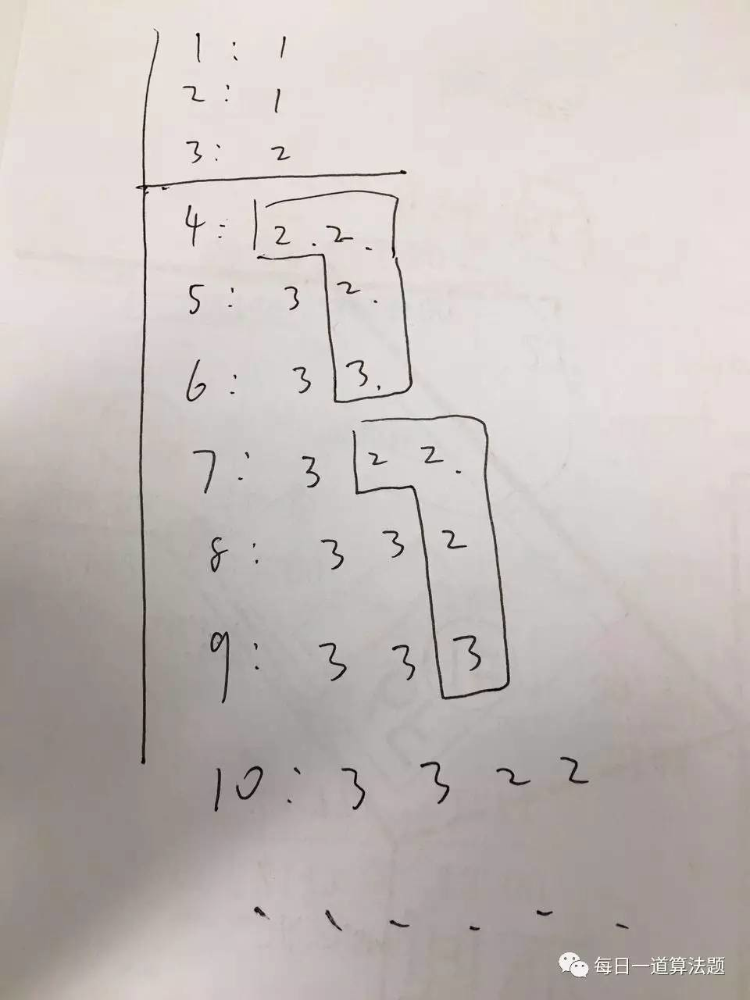

### 动态规划讲解
[动态规划](https://zh.wikipedia.org/wiki/%E5%8A%A8%E6%80%81%E8%A7%84%E5%88%92)常常适用于有重叠子问题和最优子结构性质的问题。

动态规划背后的基本思想非常简单。大致上，若要解一个给定问题，我们需要解其不同部分（即子问题），再合并子问题的解以得出原问题的解。通常许多子问题非常相似，为此动态规划法试图仅仅解决每个子问题一次，从而减少计算量：一旦某个给定子问题的解已经算出，则将其记忆化存储，以便下次需要同一个子问题解之时直接查表。这种做法在重复子问题的数目关于输入的规模呈指数增长时特别有用。

动态规划系列题目中一般涉及到3种情况，当题目中出现相关词时，可以考虑动态规划。

```
1. 求最大值或者最小值
2. 判断方案是否可行
3. 统计方案的个数
```
* 动态规划四要素

```
1. 划分状态 state，确定f[i], f[i][j]的意义；
2. 状态转化 function，确定f[i]和f[i - 1]的关系；
3. 初始状态 initialization；
4. 边界条件 确定求解最大状态是什么？
```

* 动态规划模板

动态规划没有直接的模板，但是可以通过fibonacci来理解动态规划的基本过程。

```java
public static long fibonacciDP(int n) {
    long[] results = new long[n+1];
    results[0] = 1;
    results[1] = 1;
    for (int i = 2; i <= n; i++) {
        results[i] = results[i-1] + results[i-2];
    }
    return results[n];
}
```

### 343. Integer Break [微信总结连接](https://mp.weixin.qq.com/s?__biz=MzAwMDk1MTUyNw==&mid=2247483903&idx=1&sn=7547ab490ba22d4a119eeb30e767b65f&chksm=9ae05477ad97dd6130b3d4b3f543545b4d2d7d5336e738fd6556c5fa3342fd5fc1e2ceea5772&scene=21#wechat_redirect)

题目描述
--
Given a positive integer n, break it into the sum of at least two positive integers and maximize the product of those integers. Return the maximum product you can get.

For example, given n = 2, return 1 (2 = 1 + 1); given n = 10, return 36 (10 = 3 + 3 + 4).

Note: You may assume that n is not less than 2 and not larger than 58.

注意： 题目要求至少要讲该数字分成两部分。比如2 ，一定要分成 1 + 1, 不能分成 2 + 0 。 所以当n = 2的时候，结果应该是 1 


思路解析
--
这个题目完全可以用《139. work break》分析的思路解决。

* 一. 使用暴力搜索 + 缓存	
n 的组合的乘积的最大值 应该是 如下两个值中取最大值：x * (n - x) 和  x * f(n -x)， 其中 x = 0 -> n - 1。 

举个例子，假设n = 10 :		
当x = 1，其最大值在 1 * ( 10 - 1 ) = 9  和  1 * f(9) 之间		
当x = 2，其最大值在 2 * ( 10 - 2) = 16  和  2 * f(8) 之间		
...			
当 x = 9，其最大值在 9 * (10-9) = 9 和 9 * f(1) 之间 	

然后在上叙最大值集合中找最大值，其就是结果。

任何算法都可以通过暴力搜索的基础上优化得到。我们在上面的分析中可以发现， f(x) 会被多次计算。只要将f(x)的结果缓存起来（使用 Hash Table 或者数组都行），就能减少运算次数。具体请看后面的代码。

* 二. 使用自底向上的DP写法	
其思路跟暴力搜索差不多，不同的是，暴力搜索的小标是从 n - 1 -> 1； 自底向上的写法的小标是从 1 -> n - 1,  从叶节点出发，先计算分支情况。

将动态规划问题分解成子问题时，有*自底向上*和*自顶向下*的两种方法：		
1.  自顶向下 其实就是从 根节点出发 ，深度优先搜索 一颗树 。这样复杂度是降低的，因为每次进入新的一个节点，状态是减少的。 		
2.  自底向上 是从 叶子节点出发 ，将结果汇聚到 跟节点，这样的好处是处理 很多 支路 重复的情况 ，这也是DP比较关键的有点：寻找重叠的子问题。重叠的子问题，映射到数上，就是 结果重复的分支。	

* 三. 数学解法		
这道题目的数学解法比较的有意思，而且有很多版本。

* 数学解法的第一个版本, 要求符合条件的组合的最大值，其实就是不断的将 n 分解成 3 的倍数。举个例子: 	
当 n = 10 的时候， 最大值一定是 3 + 7 (7 还没有分)；		
当 n = 7 的时候，最大值一定是 3 + 4( 4 分成 2 x 2 , 唯一特殊的数字）		
当 n = 10 的时候， 3 + 3 + 4  是符合条件的组合, 结果 3 * 3 * 4 =  36 
	
* 数学揭发的第二个版本，最佳的结果其实是按照 3 来循环的，具体请看下图 (@M.renard) 

* 数学解法的第三个版本, 思路是 f(n) = max{ f(n - 2) * 2, f(n -3) *3} (@D@vid) 

* 四. 严格数学证明
 设把N分成x份，则最大乘积为f(x) = (N/x)^x。
 f(x)对x求导，可以得到
 f'(x) = (N/x)^x * (ln (N/x) - 1) 
 令  f'(x) = 0, 求得 N/x = e 约等于2.7
 所以，如果这题可以分解成小数，尽量分解成自然对数2.7
 而2.7最近的整数就是2和3.
 2*2*2 < 3*3
 所以如果分成整数，尽量分分解成3。
 边界需要注意1，2，3，4，5。

深入讨论
--
这个问题展示了一步步分析总结，得出动态规划解法和数学解法的过程，题目解法并不唯一。

1. 熟悉 自顶向下思考 和 自底向上 写代码的方法以后，DP问题不再是不可解决的问题
2. 从简单到复杂，归纳总结，可以得出一些特别快速的数学方法。比如
3. 第二个数学解法的时间复杂度几乎是O(1） 

代码提交
--
可以查看[文件夹](./images)下面的图片，查看各个群友的提交。


### 368. Largest Divisible Subset
